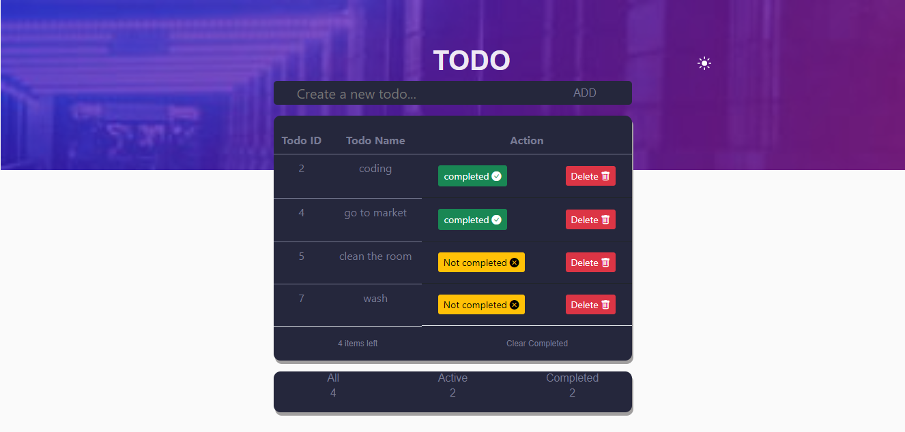
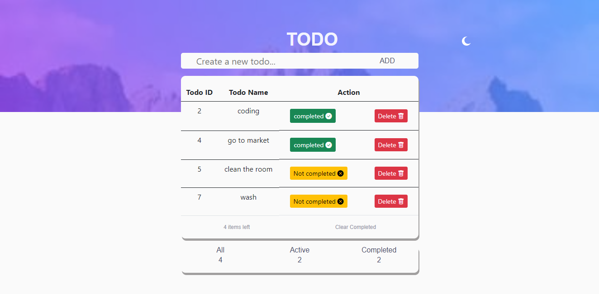

# TodoListAppWithDarkMode

full stack CRUD web application built with HTML, CSS, Bootstrap, JQuery, Python, SQLAlchemy, and Flask framework.

## Table of contents

- [Overview](#overview)
  - [The challenge](#the-challenge)
  - [Screenshot](#screenshot)
  - [Links](#links)
- [My process](#my-process)
  - [Built with](#built-with)
  - [What I learned](#what-i-learned)
  - [Useful resources](#useful-resources)
- [To use](#usage)

## Overview

### The challenge

Users should be able to:

- Check for the todos.
- Add a new todo.
- Update a todo.
- Delete a todo.
- View the optimal layout for the site depending on their device's screen size

### Screenshot





### Links

- Solution URL: (https://github.com/faozziyyah/Edulab-student-portal)
- Live link: (Not yet available)

## My process

### Built with

- HTML
- CSS
- Bootstrap
- JQuery
- Ajax
- [Flask](https://flask.palletsprojects.com/en/2.1.x/) - A web development microframework built with python
- SQLAlchemy

### What I learned

```js
$( window ).on("load", function() {
  $("#myModal").modal("show");

  var darkMode = localStorage.getItem("darkMode");

  const darkModeToggle = $('#first');

  const enableDarkMode = () => {

    $('.second').addClass('seconddark');
    $('.todoheading').addClass('todoheadingdark');
    localStorage.setItem('darkMode', 'enabled');

  }

}
```

```Python
@app.route('/')
def index():
    todo_list = Todo.query.all()
    total_todo = Todo.query.count()
    completed_todo = Todo.query.filter_by(complete=True).count()
    uncompleted_todo = total_todo - completed_todo
    return render_template('index.html', **locals())

@app.route('/add', methods=['POST'])
def add():
    title = request.form.get('title')
    new_todo = Todo(title=title, complete=False)
    db.session.add(new_todo)
    db.session.commit()
    return redirect(url_for('index'))
```

```HTML
<form class="second" action="/add" method="POST">
    <input type="text" name="title" class="todo" id="input" placeholder="Create a new todo..."/>
    <button type="submit" class="addBtn add">ADD</button>
</form>
```

### Useful resources

- [Flask](https://flask.palletsprojects.com/en/2.1.x/) - A web development microframework built with python
- [MySQL](https://www.mysql.com/) - The world's most popular open source database